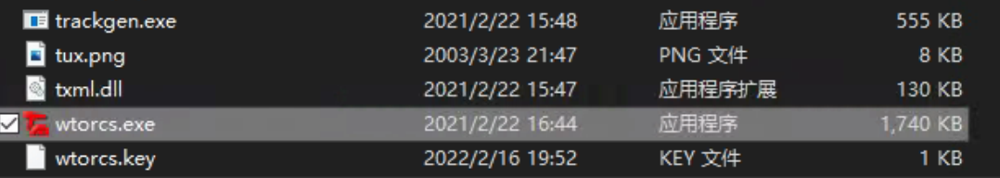
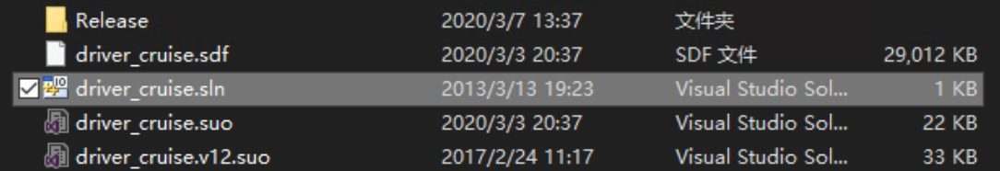

# 安装

本页面提供了在 Windows 操作系统下安装和运行 CyberTorcs 的操作教程。

## 安装要求

- 操作系统要求：Windows 10/XP
- 硬件要求：
    - CPU 最低频率：800MHz
    - 最小内存：256MB
    - 最小显存：64MB
    - 磁盘空间：>1G
- 依赖库：OpenGL 1.3
- 开发环境（推荐）：

    - 集成开发环境（IDE）：
        
        - [Visual Studio](https://visualstudio.microsoft.com/)（版本：2010/2012/2013/2017/2019）
        - [CLion](https://www.jetbrains.com/clion/)

- 代码编辑器：[Visual Studio Code](https://code.visualstudio.com/)

相关资料：[什么是编辑器和编译器，什么是集成开发环境？编译原理又是什么？](https://zhuanlan.zhihu.com/p/126164350)

## 安装步骤

### 软件安装

下载课程网站提供的软件压缩包，解压至电脑即可。

## 简单使用

### 安装 Visual Studio 集成开发环境

1. 在[交大云盘](https://jbox.sjtu.edu.cn/v/list/ent/936369142)下载 VisualStudio 的安装引导文件

2. 双击打开 VisualStudio 安装引导文件，选择需要安装的开发工具，这里选择 **使用 C++的桌面开发**，然后安装。

### 运行软件

打开解压缩后得到的文件夹 CyberTorcs，直接运行 `wtorcs.exe` 。具体软件界面介绍请参考[简介-设置菜单介绍](https://cybertorcs.readthedocs.io/zh_CN/latest/intro_settings/)。

### 编程步骤

1. 下载课程网站提供的模板代码压缩包并解压。
2. 打开工程文件`driver_cruise.sln`，调用 Visual Studio 软件打开；

3. 打开后确认编译方式为 **Release**，然后点击 **本地 Windows 调试器** 编译；

4. 若是成功编译，则显示如下图：命令行中提示“成功 1 个”。虽然会弹出窗口警告，但这是因为我们生成的是 dll 文件，而不是可执行文件，因此系统无法直接执行编译生成的结果。

!!! tip 编译失败
    初次打开项目文件编译时可能会出现编译失败，命令行中提示“重定目标”的报错信息，按命令行给出的操作方法处理即可。

1. 编译完成后，项目路径下的 Release 文件夹中新生成了 dll 文件

1. 将新生成的 dll 文件复制到 Torcs 文件夹下的 cybercruise 文件夹中，替换旧的 dll 文件

