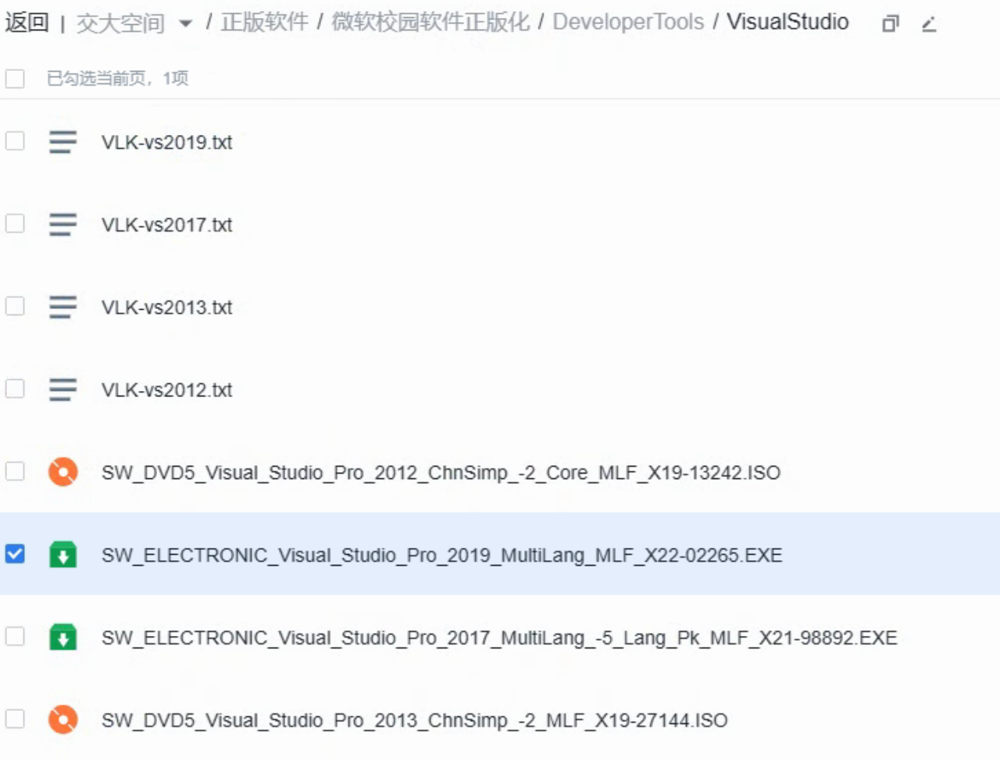
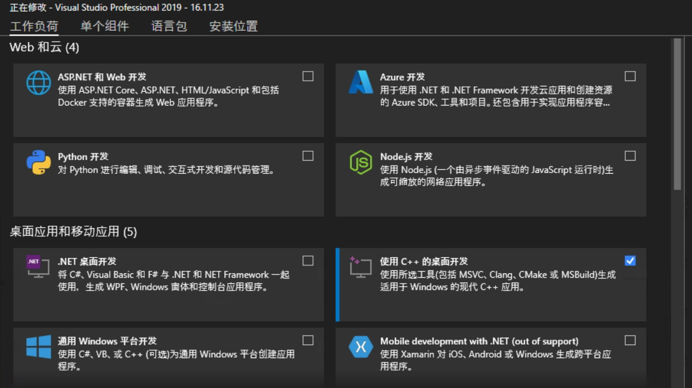
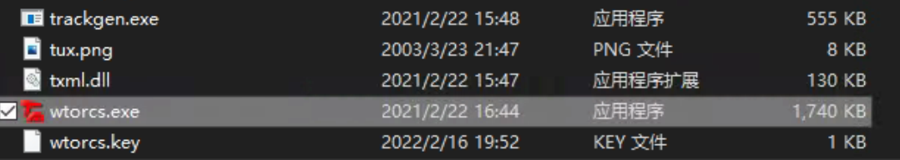
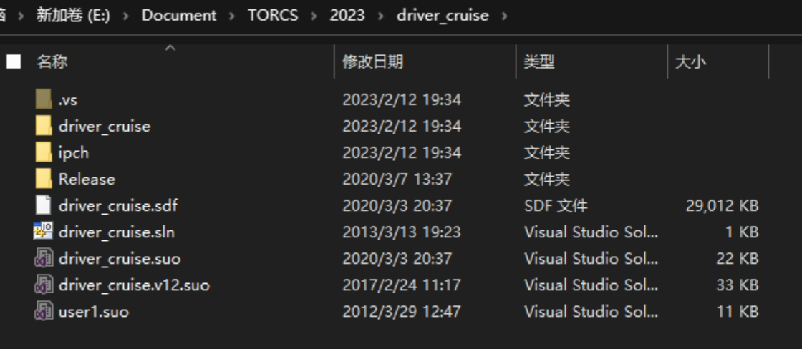
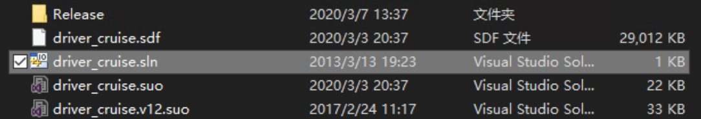
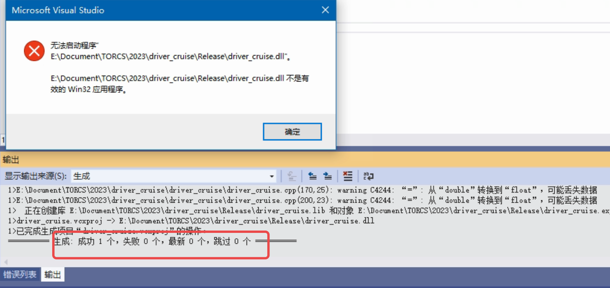
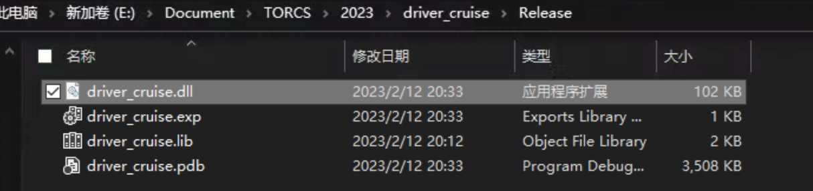
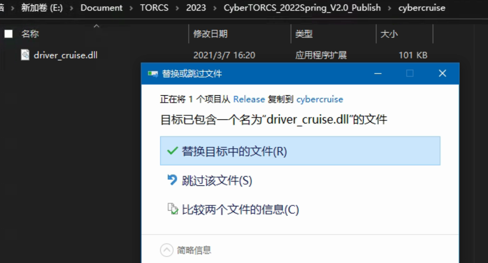

# Windows

本页面提供了在 Windows 操作系统下逐步安装 Torcs 的操作教程。

## 安装要求

### Windows 版本

### 硬件要求

- CPU 最低频率：800MHz
- 最小内存：256MB
- 最小显存：64MB
- 磁盘空间：>1G

### 依赖库

OpenGL 1.3

### 开发环境（推荐）

- 代码编译器：[Visual Studio](https://visualstudio.microsoft.com/)（版本：2010/2012/2013/2017/2019）

相关资料：[什么是编辑器和编译器，什么是集成开发环境？编译原理又是什么？](https://zhuanlan.zhihu.com/p/126164350)

## 安装

### CyberWtorcs 安装

下载课程网站提供的软件压缩包，解压至电脑即可。

### VisualStudio 安装

在[交大云盘](https://jbox.sjtu.edu.cn/v/list/ent/936369142)下载 VisualStudio 安装引导文件

双击打开 VisualStudio 安装引导文件，选择需要安装的开发工具，这里选择“使用 C++的桌面开发”，然后安装。

## 使用

### 运行软件

打开解压缩后得到的文件夹 CyberTorcs，直接运行 wtorcs.exe 即可。具体软件界面介绍参考该“简介--平台界面”部分

### 编程步骤

- 下载课程网站提供的模板代码压缩包并解压。
  

- 打开工程文件 driver_cruise.sln，调用 Visual Studio 软件打开。
  

- 打开后确认编译方式为"release"，然后点击“本地 Windows 调试器”编译
  

- 若是成功编译，则显示如下图：命令行中提示“成功 1 个”。虽然会弹出窗口警告，但这是因为我们生成的是 dll 文件，而不是可执行文件，因此系统无法直接执行编译生成的结果。
  

- 初次打开项目文件编译时可能会出现编译失败，命令行中提示“重定目标”的报错信息，按命令行给出的操作方法处理即可。

- 编译完成后，项目路径下的 Release 文件夹中新生成了 dll 文件
  

- 将新生成的 dll 文件复制到 Torcs 文件夹下的 cybercruise 文件夹中，替换旧的 dll 文件
  
