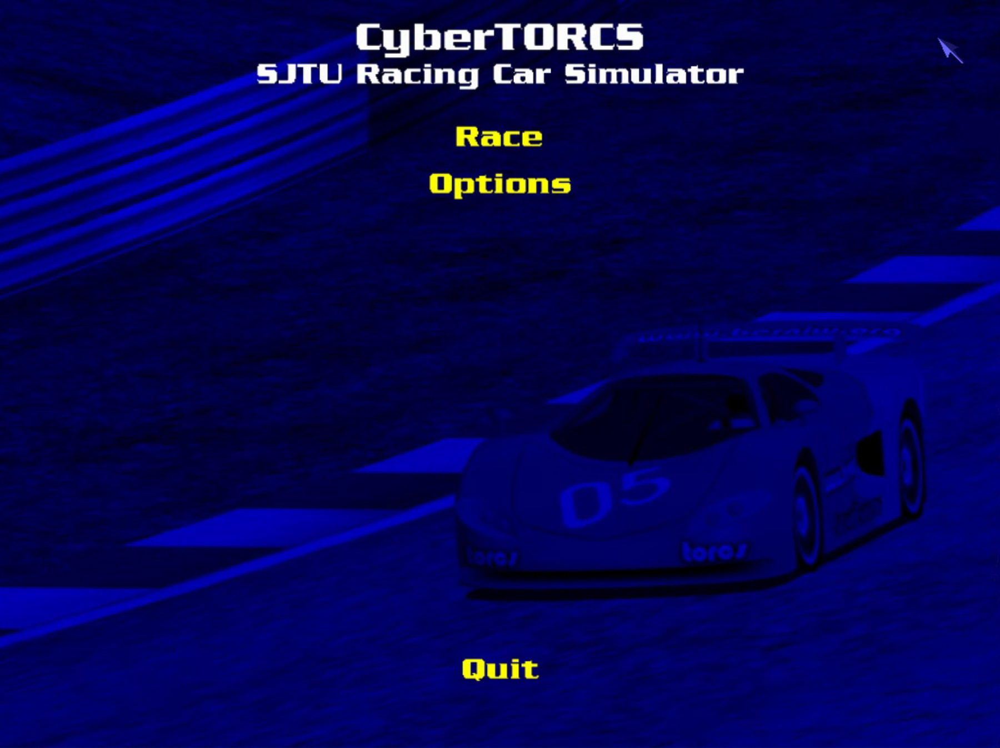
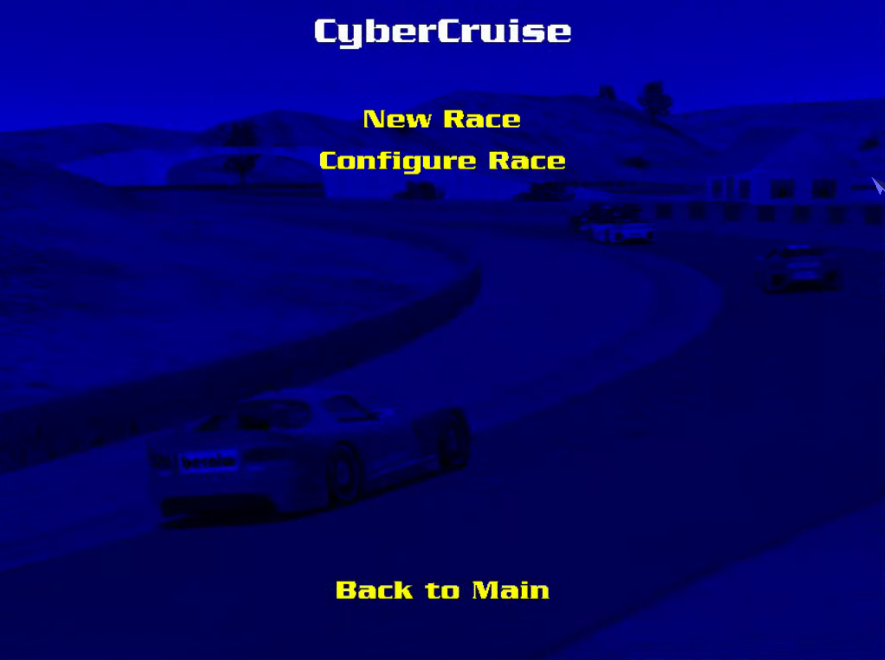
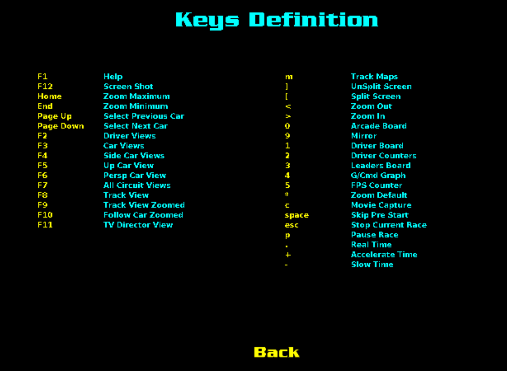

# CyberTORCS 操作界面与设置介绍

## CyberTORCS 的安装与使用

### 安装

下载压缩包 CyberTorcs_2020Spring.rar 至本地硬盘，解压缩即可

### 使用

打开解压缩后得到的文件夹 CyberTorcs，直接运行 wtorcs.exe，得到如下界面


## "Options"菜单介绍


### "Graphic"菜单——图形参数设定


参数定义如下：

```
Visibility————能见度：若系统强大，可增大该值
Smoke————每辆车的排烟量：若系统强大，可增大该值
Skid Marks————刹车痕迹：若系统强大，可增大该值
LOD Factor————细节层级因数：若系统强大，可增大该值
wheel rendering————轮渲染
```

### "Display"菜单——显示配置


可以调整屏幕分辨率，颜色深度和显示模式（窗口或全屏）等参数，然后应用所作的修改

### "Sound"菜单——声音调节


可以开关声音效果及菜单音乐

## "Race"菜单介绍

菜单中有四个选项：

```
CyberCruise——巡线（直接显示巡线过程）
CyberFollow——跟车
CyberParking——泊车
CyberOnHand——手动控制
```

以 CyberCruise 为例，点击后出现两个菜单

### "Configure Race"菜单——选择赛道

### "New Race" 菜单——进入自动巡线程序


F1 为帮助键，按下后是快捷键的说明（包括切换视角、隐藏/显示面板等）
