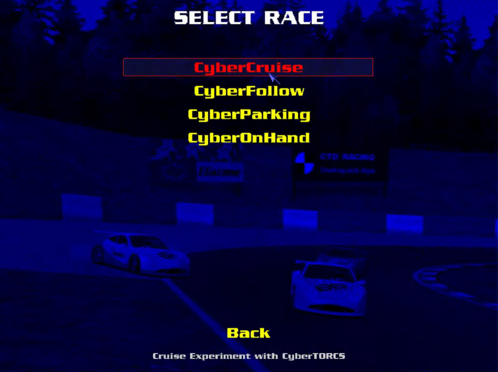
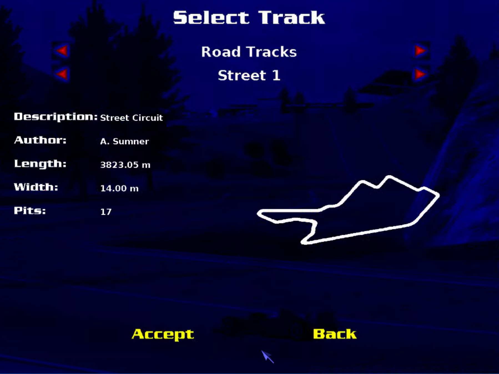
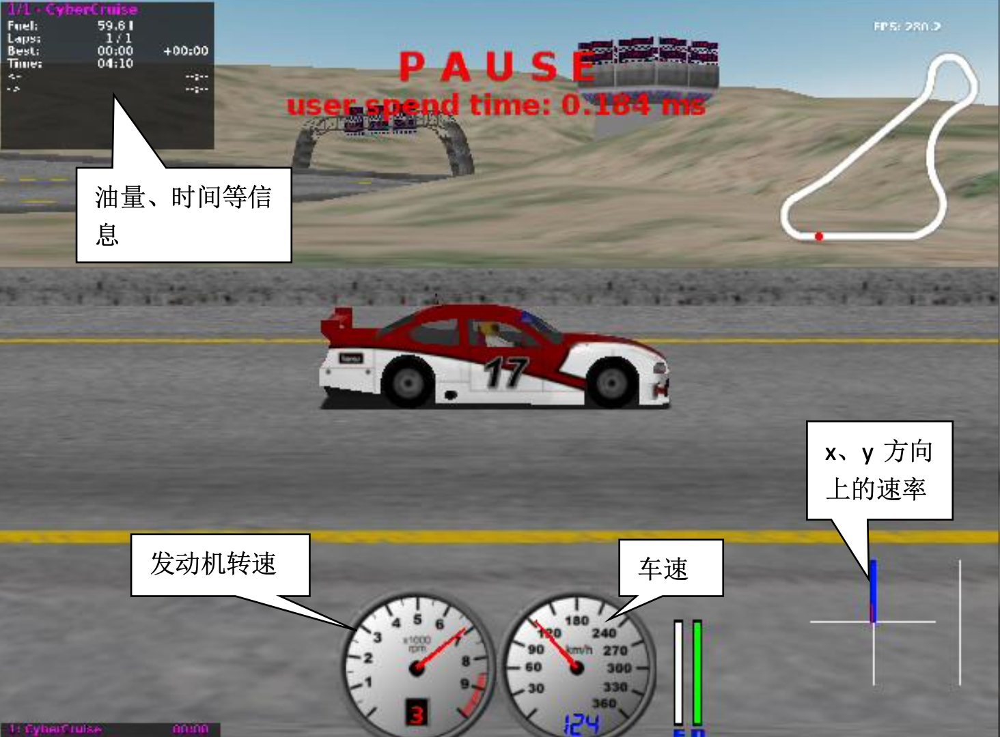
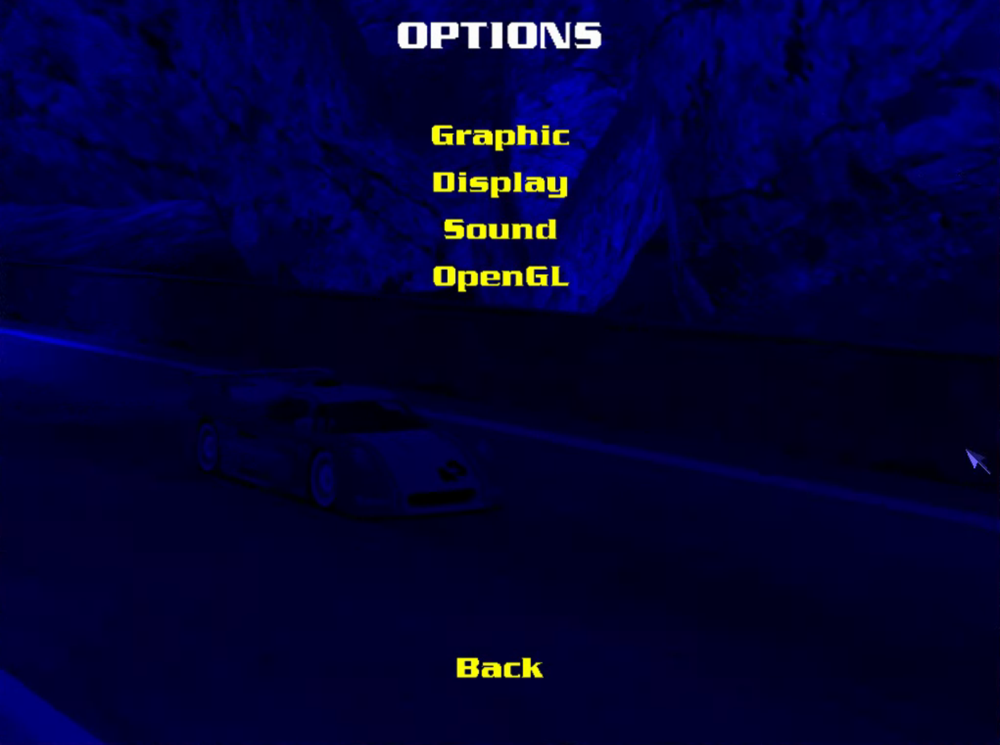
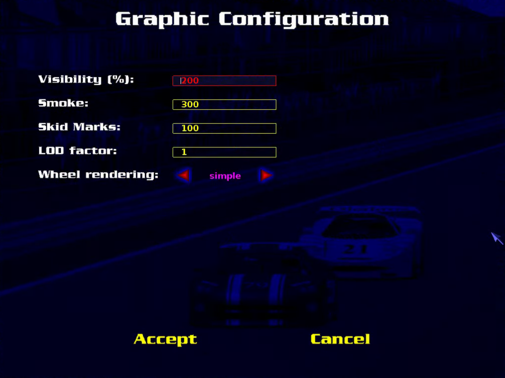
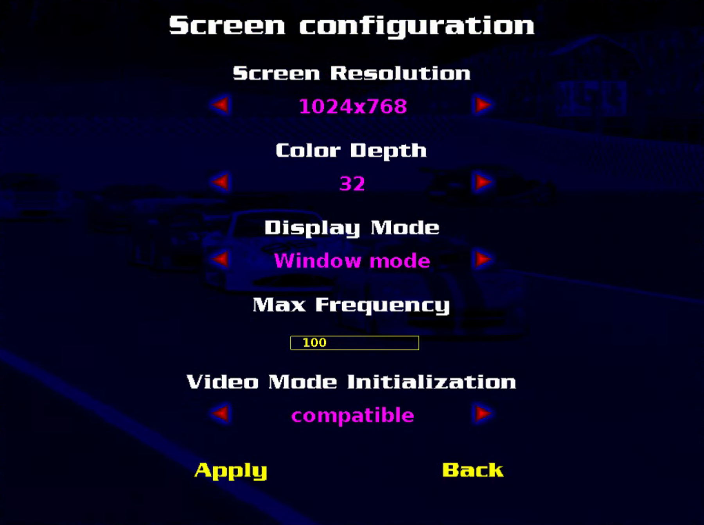
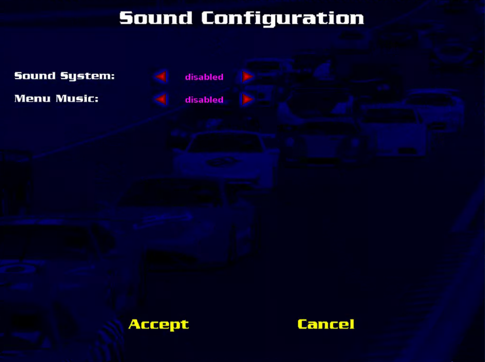
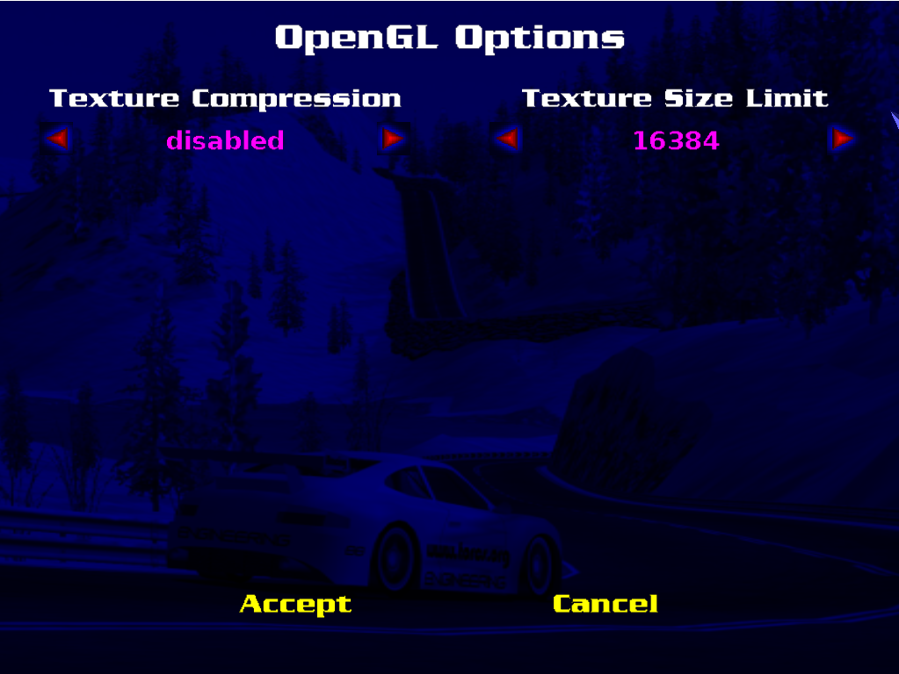
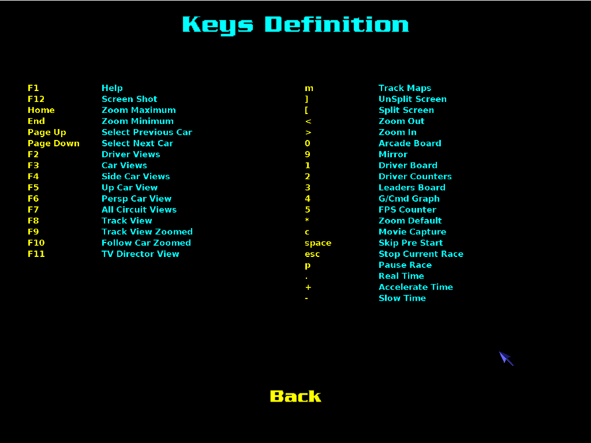

# 设置菜单介绍

## 主页面

## Race 菜单

选择驾驶场景的菜单。

- CyberCruise：巡线模式
- CyberFollow：跟车模式
- CyberParking：泊车模式
- CyberOnHand：手动模式

### "Configure Race"菜单——选择赛道

### "New Race" 菜单——进入自动巡线程序

## Options 菜单

仿真器的基础设置，**所有设置需要在应用（Apply）后才会生效**。

- Graphic：和画面质量有关的设置
- Display：和图形显示有关的设置
- Sound：和音量有关的设置
- OpenGL：和贴图质量有关的设置

### Graphic 菜单

- Visibility：可见度
- Smoke：车辆排烟量
- Skid Marks：刹车痕迹
- LOD Factor：细节层级因数
- Wheel Rendering：车轮细节渲染

### Display 菜单

- Screen Resolution：CyberTorcs 窗口分辨率
- Color Depth：色彩深度
- Display Mode：显示模式（全屏/窗口）
- Max Frequency：最大帧率
- Video Mode Initialization：视频初始化模式

### Sound 菜单

- Sound System：仿真过程中背景音乐开关
- Menu Music：设置界面音效开关

### OpenGL 菜单

- Texture Compression：是否压缩成像纹理
- Texture Size Limit：成像纹理质量限制

## 快捷键说明

按下`F1`可查看快捷键说明。

| 键位  | 功能                                  | 键位 | 功能                          |
| ----- | ------------------------------------- | ---- | ----------------------------- |
| F1    | 帮助界面（Help）                      | 0    | 数值面板 Arcade Board）       |
| F2    | 第一人称视角（Driver Views）          | 1    | 驾驶计分盘（Driver Board）    |
| F3    | 第三人称视角（Car Views）             | 2    | 驾驶仪表盘（Driver Counters） |
| F4    | 路边视角（Side Car Views）            | 3    | 排名信息（Leaders Board）     |
| F5    | 车顶视角 （Up Car View）              | 4    | 加速度方向（G/Cmd Graph）     |
| F6    | 透视视角（Persp Car View）            | 5    | 帧数（FPS Counters）          |
| F7    | 全线视角（All Circuit Views）         | 9    | 镜像（Mirror）                |
| F8    | 跟踪视角（Track View）                | m    | 地图跟踪（Track Maps）        |
| F9    | 移动跟踪视角（Track View Zoomed）     | c    | 截取视频（Movie Capture）     |
| F10   | 跟车移动视角（Follow Car Zoomed）     | p    | 暂停（Pause Race）            |
| F11   | 电视导演视角（TV Director View）      | [    | 分屏（Split Screen）          |
| F12   | 截图（Screen Shot）                   | ]    | 取消分屏（UnSplit Screen）    |
| Home  | 放大到最大（Zoom Maximum）            | <    | （Zoom Out）                  |
| End   | 缩小到最小（Zoom Minimum）            | >    | （Zoom In）                   |
| PgUp  | 切换到前一辆车（Select Previous Car） | \*   | （Zoom Default）              |
| PgDn  | 切换到后一辆车（Select Next Car）     | +    | 加速（Accelerate Time）       |
| Space | 查看赛道地图（Track Maps）            | -    | 慢速（Slow Time）             |
| Esc   | 退出（StopCurrent Race）              | .    | 正常速 （Real Time）          |

