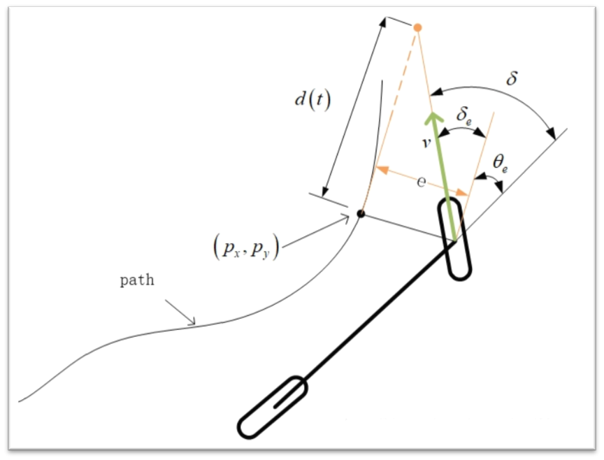

# 基于Stanley的车辆角度控制

角度误差$\delta$来源于两部分：

- 航向误差 $\delta_{\theta_e}$：在不考虑横向跟踪误差的情况下，前轮偏角和给定路径切线方向一致，用$\theta_e$表示车辆航向与最近路径点切线方向之间的夹角，，在没有任何横向误差的情况下，前轮方向与所在路径点的方向相同：

$$
\delta_{\theta_e}(t) = \theta_e(t)
$$

- 横向偏差 $\delta_e$：在不考虑航向跟踪偏差的情况下，横向跟踪误差越大，前轮转向角越大，假设车辆预期轨迹在距离前轮 $d(t)$ 处与给定路径上最近点切线相交，根据几何关系得出如下非线性比例函数：

$$
\delta_e(t) = \arctan\frac{e(t)}{d(t)} = \arctan\frac{k\cdot e(t)}{v(t)}
$$

综合两方面控制因素，基本转向角控制率如下：

$$
\delta(t) = \theta_e(t) + \arctan\frac{k\cdot e(t)}{v(t)}
$$

对应代码如下


```cpp
  double lfAngleError = -atan2(
    _midline[5][0]- _midline[4][0],
    _midline[5][1] - _midline[4][1]
  ); 

  double lfDistance = \
  	_midline[0][0] < 0 ? length(_midline[0][0], _midline[0][1], 0, 0) :
    -length(_midline[0][0], _midline[0][1], 0, 0);

  double lfStanley_K;
  circle Curve4Stanley = getR(
    _midline[0][0], _midline[0][1],
    _midline[10][0], _midline[10][1],
    _midline[20][0], _midline[20][1]
  );
  
  if (Curve4Stanley.r < 50)
    lfStanley_K = 11;
  else if (Curve4Stanley.r < 100)
    lfStanley_K = 7;
  else
    lfStanley_K = 3;

  double lfDistanceError = atan(lfStanley_K * lfDistance / _speed);
  *cmdSteer = constrain(-1, 1, lfAngleError + lfDistanceError);
```


