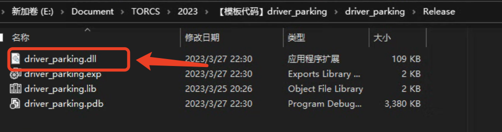
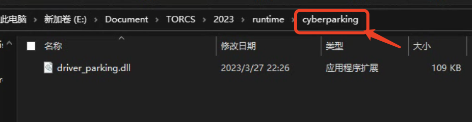

# 泊车任务

## 任务介绍

泊车速度越快越好
- 起点:某固定里程
- 检验:泊位完毕标志 
- 终点:某固定里程
- 泊车精度越高越好
- 泊车朝向精度要求<10°，超出则失败，失败得分999 - 泊车精度定义:车辆四个角点偏差距离之和

成绩计算方法：泊车时间 x (1 + 10x偏差距离和/车宽)

## 接口定义

相比于巡线任务，泊车任务新增了以下参数用于完成泊车操作：

### 控制模型的输入变量

对下述变量不理解的同学可以将变量输出到终端，查看数据的变化从而理解具体的意义。

| 变量 | 说明 |
| ----- | ----- |
| `_lotX` | **车位中心的X坐标**， |
| `_lotY` | **车位中心的Y坐标**， |
| `_lotAngle` | **车位方向** |
| `_carX` | **车辆当前的X坐标** |
| `_carY` | **车辆当前的Y坐标** |
| `_caryaw` | **车身方向** |

### 控制模型的输出变量

| 变量 | 说明 |
| ----- | ----- |
| `bFinished` | 完成停车判定符，用户完成停车后将该变量置为true，系统以此时刻车辆状态计算泊车误差。 |

## 运行教程

整体流程与巡线任务一致：
step 1：在release模式下编译代码，在release文件夹下找到dll文件。

step 2：将dll文件复制到cyberparking文件夹下。

## 模板代码简介

模板代码将整个泊车环节分为以下流程：

| 变量 | 说明 |
| ----- | ----- |
| `StageApproaching` | **车辆在道路行驶接近车位**， |
| `StageKeepRight` | **车辆靠右行驶**， |
| `StageTurnLeft` | **车辆向左转调整方向** |
| `StageEnterLot` | **车辆进入车位** |
| `StageLeaveLot` | **车辆离开车位** |
| `StageBackToRoad` | **车辆返回道路** |
| `StageLeave` | **车辆继续在道路行驶** |

在 'userDriverSetParam' 函数中，根据车辆与车位的状态关系，确认车辆在哪个泊车流程，用switch case 语句，使车辆在不同的流程下使用相应的控制参数。
