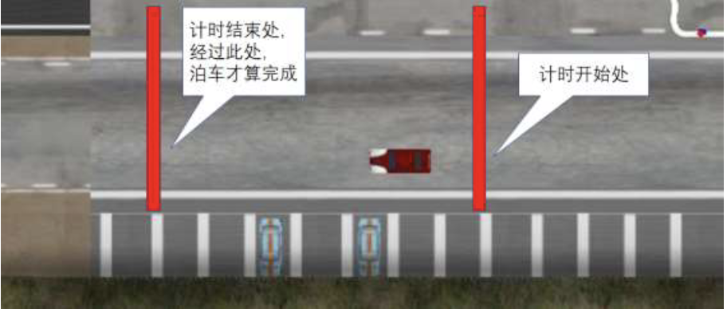

# 泊车任务

## 任务简介

泊车速度越快越好
- 起点:某固定里程
- 检验:泊位完毕标志 
- 终点:某固定里程
- 泊车精度越高越好
- 泊车朝向精度要求<10°，超出则失败，失败得分999 - 泊车精度定义:车辆四个角点偏差距离之和

成绩计算方法：泊车时间 x (1 + 10x偏差距离和/车宽)

## 详细说明

### 泊车设置

### 泊车流程
1. 入库
2. 示意停稳：置bFinish = 1（泊车停稳时置bFinish=1，告知系统车已停稳，请求系统记录数据以备后续计算泊车精度使用。如果此时速度>0.2km/h，泊车失败）
3. 出库

### 详细规则
1. 将车泊入绝对坐标为(lotX, lotY)的车位，前面路段用巡线方法开
2. 成绩计算：泊车时间* (1+10*偏差距离/车长)。偏差距离：车辆四个顶点偏差距离之和。泊车时间：如下图所示，两个计时点时间相减。

3. 泊车时不得与旁边两辆车发生碰撞，也不得与栏杆碰撞。当damage值>1时会直接退出显示“ Your damage is too large!”，龙套车不受该规则影响。
4. 没有置bFinished位比赛就结束或者没有到达规定里程（即开始计时的里程）就置位，会显示“Failed! Haven't startingparking!”
5. 置位bFinished时车体速度大于0.2 km/h （注意单位），会显示“ Failed! Your speed is too fast whenparking!”
6. 最后车体的航向角所在直线和提供的lotAngle所在直线的夹角超过10度（注意单位），会显示“Failed! Your car yaw is not accurateenough!”
7. 过两个计时点要求正向通过，极限位置如下图(a)所示

8. 泊车入库可以车头入库也可以车尾入库
9. 所有车位的指向均由车库中心指向道路10.全局坐标指向如上图(b)所示

## 接口定义

相比于巡线任务，泊车任务新增了以下参数用于完成泊车操作：

### 控制模型的输入变量

对下述变量不理解的同学可以将变量输出到终端，查看数据的变化从而理解具体的意义。

| 变量 | 说明 |
| ----- | ----- |
| `_lotX` | **车位中心的X坐标**， |
| `_lotY` | **车位中心的Y坐标**， |
| `_lotAngle` | **车位方向** |
| `_carX` | **车辆当前的X坐标** |
| `_carY` | **车辆当前的Y坐标** |
| `_caryaw` | **车身方向** |

### 控制模型的输出变量

| 变量 | 说明 |
| ----- | ----- |
| `bFinished` | 完成停车判定符，用户完成停车后将该变量置为true，系统以此时刻车辆状态计算泊车误差。 |

## 运行教程

整体流程与巡线任务一致：
step 1：在release模式下编译代码，在release文件夹下找到dll文件。

step 2：将dll文件复制到cyberparking文件夹下。

## 模板代码简介

模板代码将整个泊车环节分为以下流程：

| 变量 | 说明 |
| ----- | ----- |
| `StageApproaching` | **车辆在道路行驶接近车位**， |
| `StageKeepRight` | **车辆靠右行驶**， |
| `StageTurnLeft` | **车辆向左转调整方向** |
| `StageEnterLot` | **车辆进入车位** |
| `StageLeaveLot` | **车辆离开车位** |
| `StageBackToRoad` | **车辆返回道路** |
| `StageLeave` | **车辆继续在道路行驶** |

在 'userDriverSetParam' 函数中，根据车辆与车位的状态关系，确认车辆在哪个泊车流程，用switch case 语句，使车辆在不同的流程下使用相应的控制参数。
