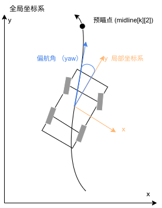

# 巡线任务

## 任务介绍

在CyberTorcs中，巡线任务被定义为让自控车辆沿着道路中线前进的任务，主要用于测试控制算法的精度和稳定性。

在具体实验过程中，一般会随机选取5～6条赛道，要求编写一套算法，能让自控车辆沿着赛道跑完全程，并记录运行过程中的一些物理量的数值，作为量化评价算法效果的依据。

## 评价规则

CyberTorcs在评价模型的巡线表现时，使用了以下定量表达式：

- **速度**：使用单圈完成时间和碰撞损失之和表示
  
    $Total_T = Time + Damage / 10$

- **精度**：用车体偏离道路中线的偏差表示，在时间纬度上进行累积，为了去除距离的量纲除以了车长

    $Total_E = Error / CarLength$

**总评分**为 $Total_T&E$，速度指标除以4是经验值。

$$
Total_T&E = (Time + Damage / 10) / 4 + Error / CarLength
$$

```cpp
/* 以下为Total_E中Error的具体计算方式 */

float error = 0;

double if_to_middle = sqrt(midline[0][0] * midline[0][0] + midline[0][1] * midline[0][1]);

error += abs(if_to_middle) + \
    abs((abs((car_length / 2.0) * tan(yaw)) + (car_width / 2.0)) / cos(yaw)) - \
    (car_width / 2.0);
```

## 接口定义

### 控制模型的输入变量

| 变量 | 说明 |
| ----- | ----- |
| `float midline[k][2]` | **预瞄点**，沿道路中线 *k* 米处的相对于当前车辆坐标系的坐标值。<br>例如，(`midline[10][0]`, `midline[10][1]`) <br>表示沿道路中线前方10米处的点相对于当前车辆坐标系的 *(x,y)* 坐标， <br>考虑到实际感知技术的极限，目前设定 *k <= 200*。 |
| `float yaw` | **偏航角（弧度）**，指车头朝向与车辆前轮方向的夹角。 |
| `float yawrate` | **角速度（弧度/秒）** |
| `float speed` | **车速（公里/小时）** |
| `float acc` | **加速度（米/秒<sup>2</sup>）** |
| `float width` | **道路宽度（米）** |
| `float gearbox` | **档位**，选项 {0, 1, 2, 3, 4, 5, 6}，0为空挡。 |
| `float rpm` | **发动机转速（转/分钟）** |



### 控制模型的输出变量

| 变量 | 说明 |
| ----- | ----- |
| `float *cmdAcc` | 油门控制，范围 [0.0, 1.0]，0.0 表示不踩油门，1.0表示踩满油门。 |
| `float *cmdBrake` | 刹车控制，范围 [0.0, 1.0]，0.0 表示不踩刹车，1.0表示踩满刹车。 |
| `float *cmdSteer` | 转向控制，范围 [-1.0, 1.0]，-1.0 表示方向盘向左打满，1.0表示方向盘向右打满。 |
| `float *cmdGear` | 变速箱档位，选项 {0, 1, 2, 3, 4, 5, 6}，0为空挡。 |
